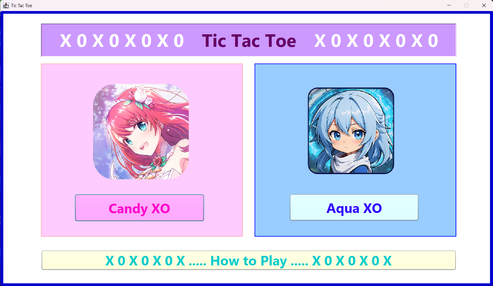
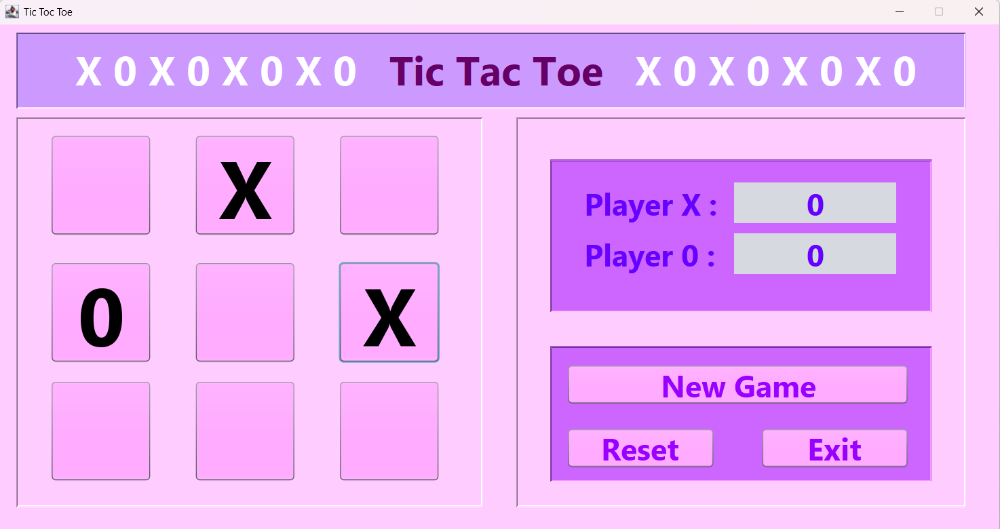
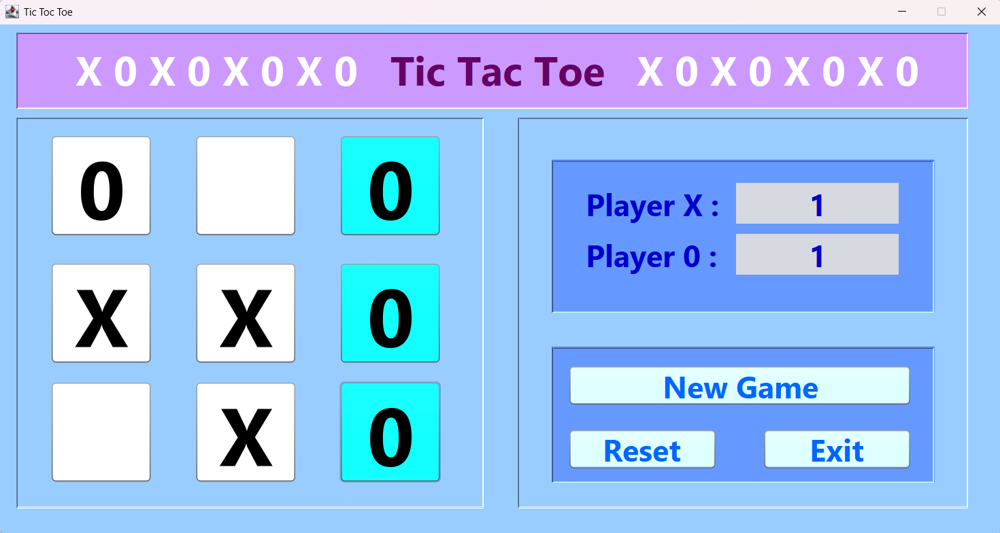

# ❌⭕ Tic Tac Toe Game ⭕❌ 

 Implemented the Tic Tac Toe_Game by using the Java programming language. That fun graphical Tic-Tac-Toe game built using <B> Java Swing </B>, featuring X and 0 players, scoring, and game rules enforcement. Players can also select their preferred theme for a personalized gaming experience. 

---

## 🎮 How to Play

- Tic-Tac-Toe is a simple two-player game played on a 3×3 grid. 
- One player uses X and the other uses O. 
- Players take turns placing their symbol in an empty square. 
- The goal is to get three of the same symbols in a row, column, or diagonal. 
- If all squares are filled and no one has three in a row, the game ends in a draw.

---

## 🔧 Button Functions

- **New Game**: Resets scores and clears the board.
- **Reset**: Clears the board but keeps current scores (disabled after 3 wins).
- **Exit**: Closes the game with confirmation.

---

## 📸 Screenshots

  

  
  

## 🎮 How to Run

1. Download or clone this repository
2. Open the project in **NetBeans** (or any Java IDE that supports Swing)
3. Compile & run the program
4. Play the game by clicking on the buttons

---

## 📋 License

This project is free to use and modify for learning purposes.

---

 Don't forget to hit the ⭐ if you like this repo. 
